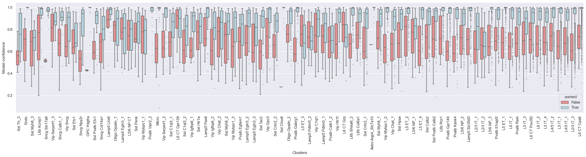
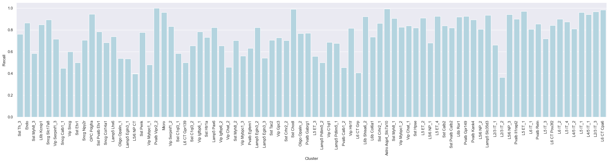
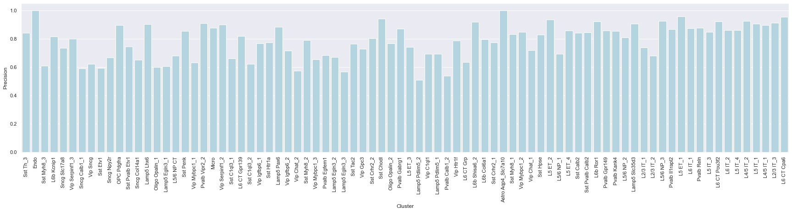
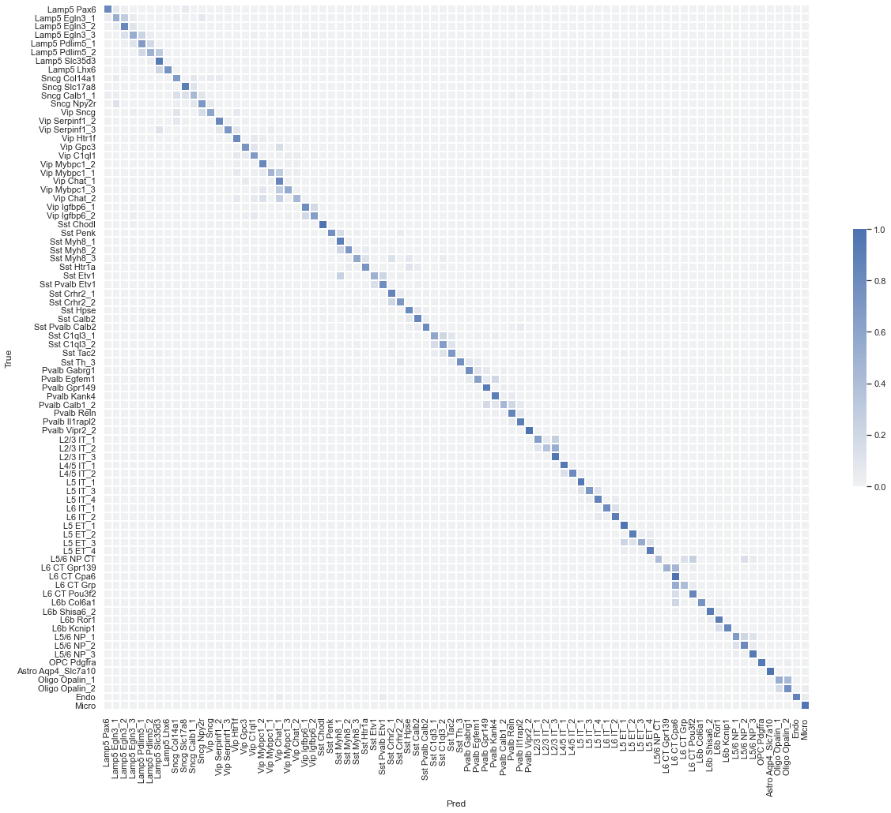
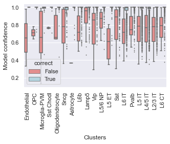
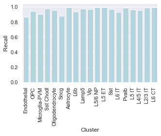
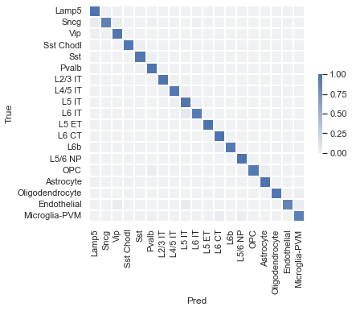

# Model card for `mlp_nsf`

### Model details

- Summary:
    - Inputs `X` are log(CPM) normalized expression values of 187 marker genes chosen by NS Forest algorithm. 
    - Encoder and label heads are fully connected neural networks
    - `P_cluster` values are interpreted as per-cluster assignment probabilities (similar for `P_subclass`)
 - Developer: Rohan Gala
 - Repository: [ctype_classifier](https://github.com/alleninstitute/ctype_classifier), commit `#dfa2aa`
 - Training weights:  --
 - Publication: --

### Intended use
 - Primary uses: 
    1. Classification of scRNA-seq samples into cell types and subclasses
    2. Baseline for comparison with other classification models 
 - Users: AIBS scientists and bioinformaticians
 - Out of scope: Inference on other modalities (e.g. SMART-seq), or regions (e.g. V1), or species (e.g. primate)

### Metrics
 - Cross entropy on validation set
 - Overall accuracy (fraction correct) on validation set

### Training and evaluation
 - M1 single nucleus 10xV3 dataset (benchmark pilot)
 - Cluster and subclass annotations were used to train the model in a supervised fashion. 
 - 10-fold cross validation scheme for evaluation
 - Model weights with best total cross-entropy (over cluster and subclass labels) were retained for each fold. 

### Quantitative analysis

#### Cluster level metrics: 
1. Confidence values for correctly and incorrectly assigned labels 

2. Label-wise recall 

3. Label-wise precision 

4. Confusion matrix (row-normalized) 

#### Subclass level metrics: 
1. Confidence values for correctly and incorrectly assigned labels 

2. Label-wise recall 

3. Label-wise precision 

4. Confusion matrix (row-normalized) 

### Recommendations and caveats
 - Subclass level metrics are excluded - the model makes few errors. 
 - Inputs are expected to be log transformed (natural base) CPM values.
 - If some of the input genes are missing, replace values with zeros - model is robust to such "gene dropout" to a degree. 
 - MLP models are known to not be [well-callibrated](http://proceedings.mlr.press/v70/guo17a/guo17a.pdf), and is an area of potential improvement for assignment confidence.