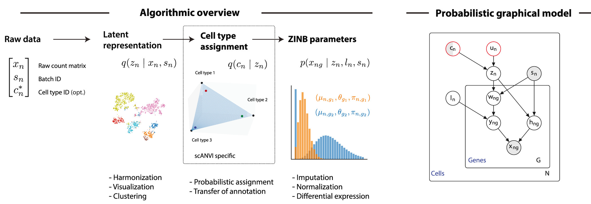
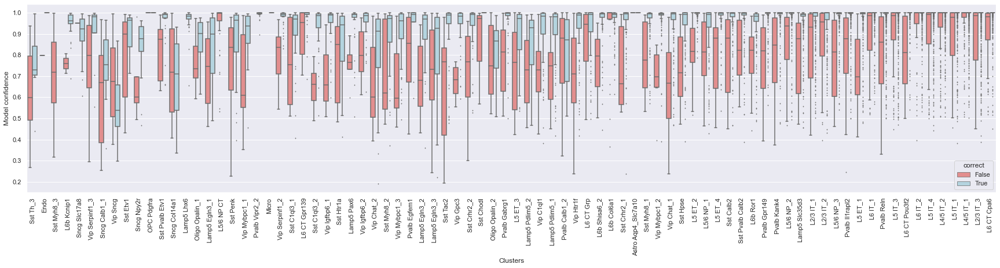
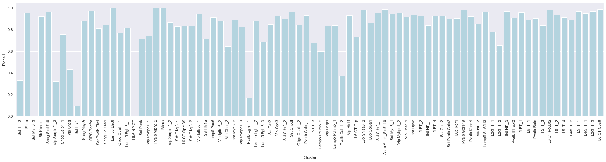
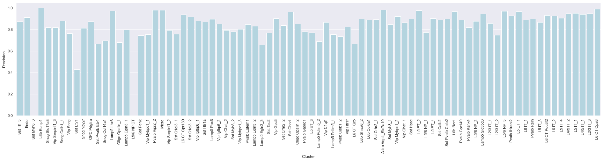
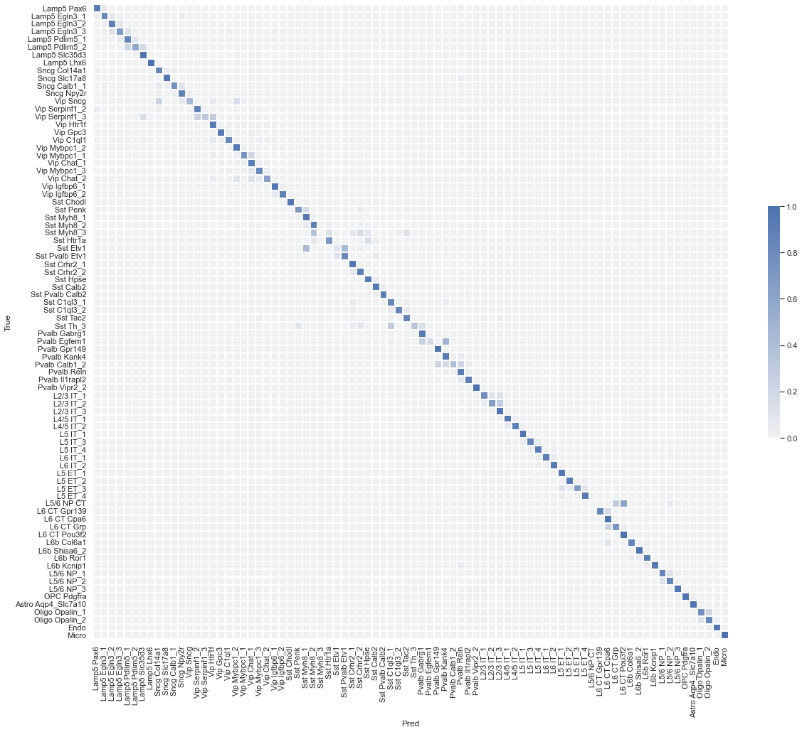
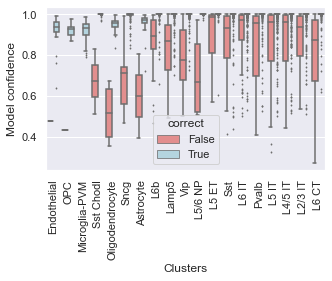
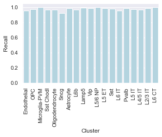
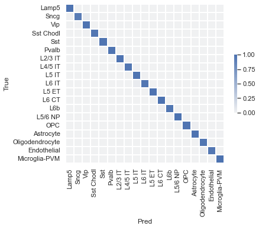

# Model card for `scANVI`

### Model details

Schematic:

- Summary: --
 - Developer: Kyle Travaglini
 - Repository: --
 - Training weights:  --
 - Publication: [Xu et al. 2021](https://www.embopress.org/doi/abs/10.15252/msb.20209620)

### Intended use
 - Primary uses: 
    1. Classification of scRNA-seq samples into cell types and subclasses
    2. Baseline for comparison with other classification models 
 - Users: AIBS scientists and bioinformaticians
 - Out of scope: Inference on other modalities (e.g. SMART-seq), or regions (e.g. V1), or species (e.g. primate)

### Metrics
 - Cross entropy on validation set
 - Overall accuracy (fraction correct) on validation set

### Training and evaluation
 - M1 single nucleus 10xV3 dataset (benchmark pilot)
 - Cluster and subclass annotations were used to train the model in a supervised fashion. 
 - 10-fold cross validation scheme for evaluation
 - Model weights with best total cross-entropy (over cluster and subclass labels) were retained for each fold. 

### Quantitative analysis

#### Cluster level metrics: 
1. Confidence values for correctly and incorrectly assigned labels 

2. Label-wise recall 

3. Label-wise precision 

4. Confusion matrix (row-normalized) 

#### Subclass level metrics: 
1. Confidence values for correctly and incorrectly assigned labels 

2. Label-wise recall 

3. Label-wise precision 

4. Confusion matrix (row-normalized) 

### Recommendations and caveats
