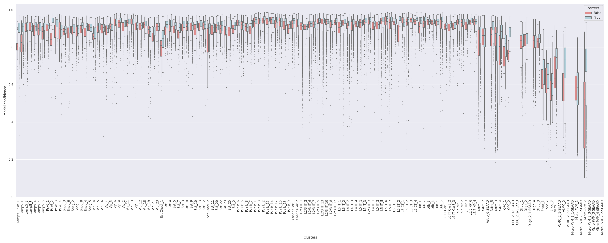
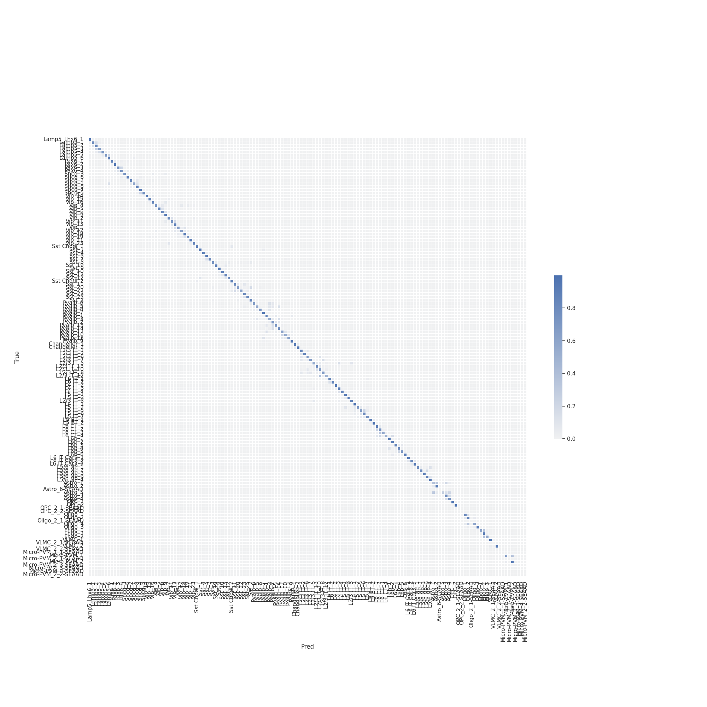
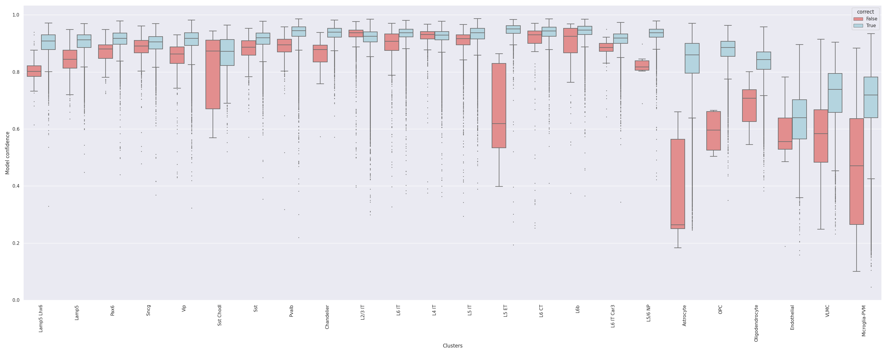
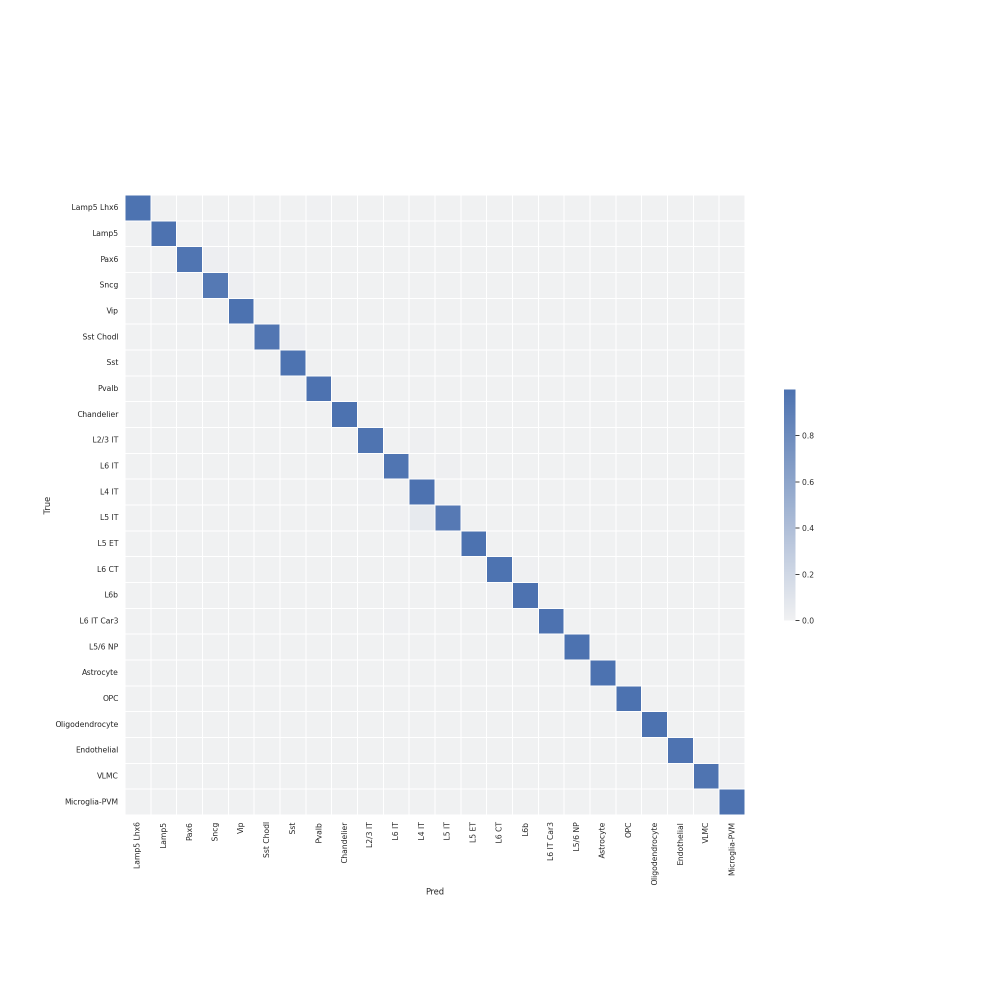
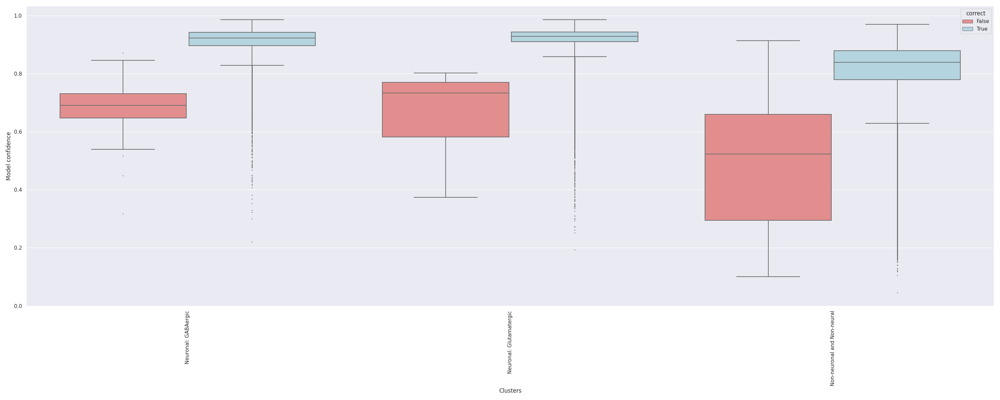
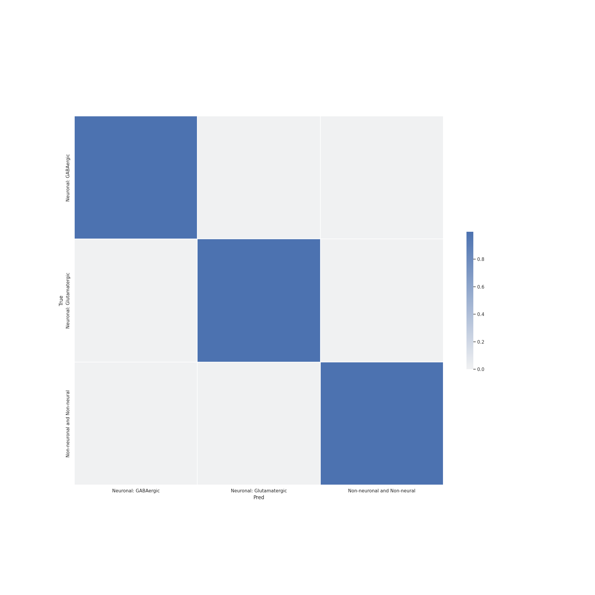
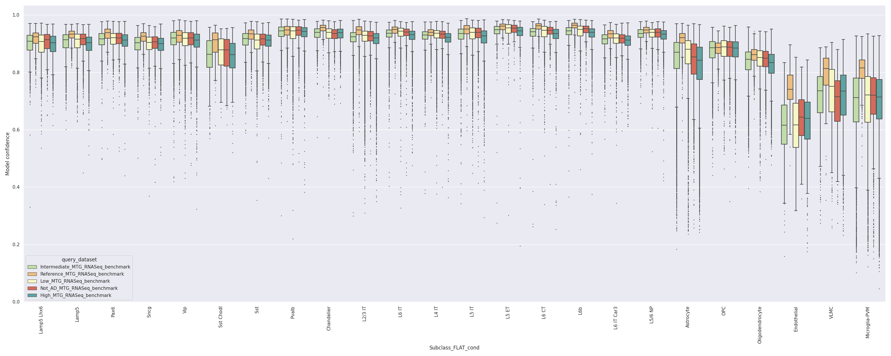
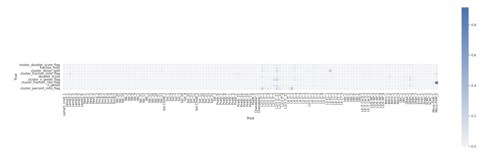

# Report card for `FLAT` on `Human SEA-AD` benchmark

### Overview

The accuracy of cell type mapping using the flat correlation (FLAT) algorithm was evaluated against the SEA-AD human MTG benchmark.

In summary, `FLAT` was able to achieve **strong accuracy** at **all** resolution of the human MTG taxonomy containing donor-specific batch effects.

- Summary:
    - Inputs `X` are log(CPM) normalized expression values of marker genes.
    - Hierarchy was encoded by Class, Subclass, Supertype.
    - `Confidence` values were derived via bootstraping.
 - Runtime: 1.835 Hours
 - Version: X.Y.Z
 - Repository: [TBD](TBD)
 - Publication: --

Annotaion | F1-score
--- | --- 
Class | 0.999 
Subclass | 0.985
Supertype | 0.871

### Tasks
 - Primary tasks:
    1. Classification of scRNA-seq samples into Supertypes.
    2. Determining generalization of `FLAT` classification to samples from new donors under varying degrees of Alzheimers pathology.
 - Users: AIBS scientists and community mapping tool users.
 - Out of scope: Classification on other modalities (e.g. SMART-seq, Patch-seq, MERFISH), or regions (e.g. V1), or species (e.g. primate)

### Metrics
 - Accuracy
 - Precision, Recall, F1-score on validation sets.

### Reference and query evaluation data
 - Reference
    - Human MTG single nucleus 10xV3 dataset from aged healthy individuals.
    - Supertype and donor metadata provided for each reference sample.
 - Query
    - Human MTG single nucleus 10xV3 data from donors of varying Alzheimers pathology.
        - No AD
        - Low
        - Intermediate
        - High

### Quantitative analysis

Here we evaluate `FLAT` at predicting high quality samples for each of the query datasets.

#### Supertype metrics:
1. Label-wise F1-score 

2. Confidence values for correctly and incorrectly assigned labels 

3. Label-wise recall 

4. Label-wise precision 

5. Confusion matrix (row-normalized) 

#### Subclass level metrics:
1. Label-wise F1-score 

2. Confidence values for correctly and incorrectly assigned labels 

3. Label-wise recall 

4. Label-wise precision 

5. Confusion matrix (row-normalized) 

#### Subclass level metrics:
1. Label-wise F1-score 

2. Confidence values for correctly and incorrectly assigned labels 

3. Label-wise recall 

4. Label-wise precision 

5. Confusion matrix (row-normalized) 

### Donor effect analysis

Here we evaluate `FLAT` at correctly predicting the Subclass label for increasingly sever Alzheimers pathology.

Annotation | Query | F1-score
--- | --- | ---
Supertype | Reference_MTG_RNASeq_benchmark | 0.986
Supertype | Not_AD_MTG_RNASeq_benchmark | 0.988
Supertype | Low_MTG_RNASeq_benchmark | 0.987
Supertype | Intermediate_MTG_RNASeq_benchmark | 0.986
Supertype | High_MTG_RNASeq_benchmark | 0.983

### Low quality sample analysis

Here we evaluate how `FLAT` predicts labels for low-quality samples in the query data with predefined QC flags.

### Recommendations and caveats
 - At the **Class** and **Subclass** level, for high quality RNA-seq data - `FLAT` makes few errors.
 - `FLAT` robustly classify samples under varying conditions imparting donor and disease specific changes in gene expression.
 - When `FLAT` makes a mistake at the **Supertype** level, the predicted label is typically within the same **Subclass**.
