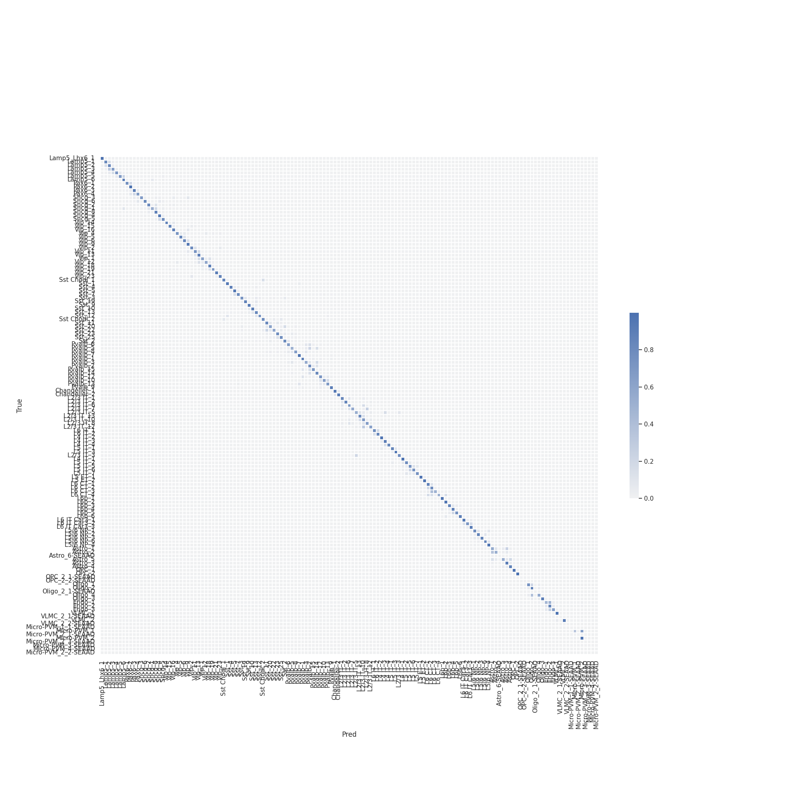
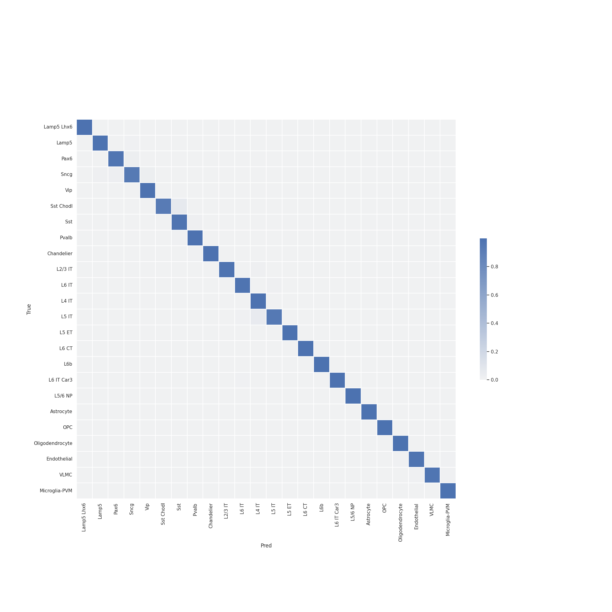
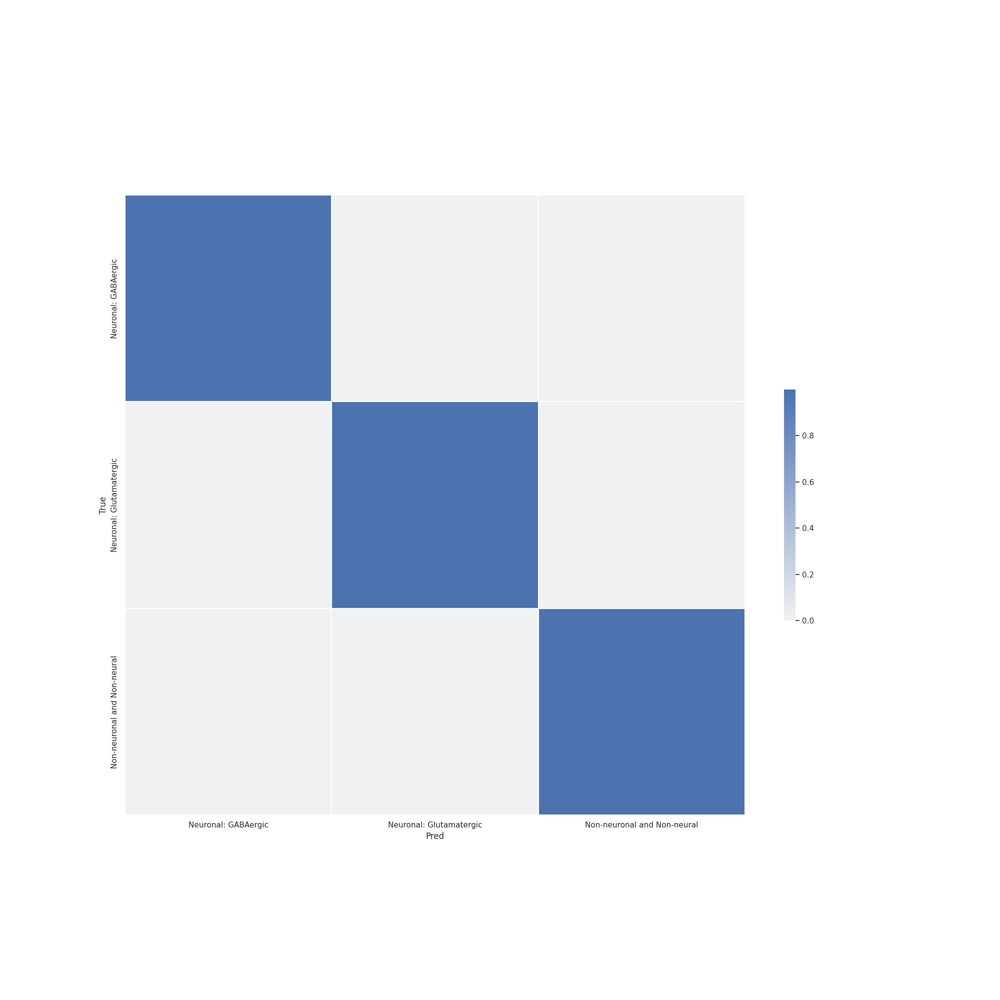
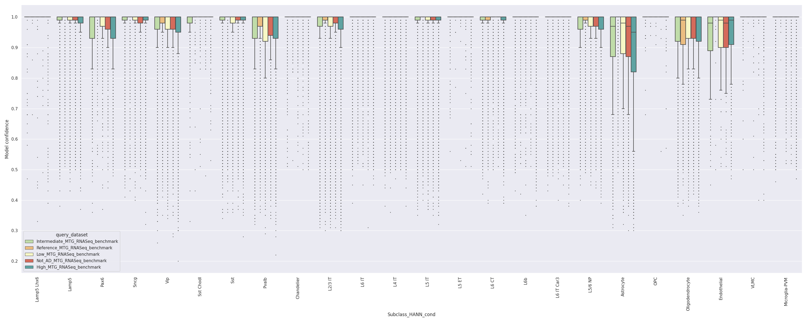

# Report card for `HANN` on `Human SEA-AD` benchmark

### Overview

The accuracy of cell type mapping using the Hierarchical approximate nearest neighbor (HANN) algorithm was evaluated against the SEA-AD human MTG benchmark. 

In summary, `HANN` was able to achieve **strong accuracy** at **all** resolution of the human MTG taxonomy containing donor-specific batch effects.

- Summary:
    - Inputs `X` are log(CPM) normalized expression values of marker genes. 
    - Hierarchy was encoded by Class, Subclass, Supertype.
    - `Confidence` values were derived via bootstraping.
 - Runtime: 3.03 Hours
 - Version: X.Y.Z
 - Repository: [TBD](TBD)
 - Publication: --

Annotaion | F1-score 
--- | --- 
Class | 0.999 
Subclass | 0.985 
Supertype | 0.859 

### Tasks
 - Primary tasks: 
    1. Classification of scRNA-seq samples into Supertypes.
    2. Determining generalization of `HANN` classification to samples from new donors under varying degrees of Alzheimers pathology.
 - Users: AIBS scientists and community mapping tool users.
 - Out of scope: Classification on other modalities (e.g. SMART-seq, Patch-seq, MERFISH), or regions (e.g. V1), or species (e.g. primate)

### Metrics
 - Accuracy
 - Precision, Recall, F1-score on validation set

### Reference and query evaluation data
 - Reference
    - Human MTG single nucleus 10xV3 dataset from aged healthy individuals.
    - Supertype and donor metadata provided for each reference sample.
 - Query
    - Human MTG single nucleus 10xV3 data from donors of varying Alzheimers pathology.
        - No AD
        - Low
        - Intermediate
        - High

### Quantitative analysis 

Here we evaluate `HANN` at predicting high quality samples for each of the query datasets.

#### Supertype metrics: 
1. Confidence values for correctly and incorrectly assigned labels 

2. Label-wise recall 

3. Label-wise precision 

4. Confusion matrix (row-normalized) 

#### Subclass level metrics: 
1. Confidence values for correctly and incorrectly assigned labels 

2. Label-wise recall 

3. Label-wise precision 

4. Confusion matrix (row-normalized) 

#### Subclass level metrics: 
1. Confidence values for correctly and incorrectly assigned labels 

2. Label-wise recall 

3. Label-wise precision 

4. Confusion matrix (row-normalized) 

### Donor effect analysis

Here we evaluate `HANN` at correctly predicting the Subclass label for increasingly sever Alzheimers pathology.

### Low quality sample analysis

Here we evaluate how `HANN` predicts labels for low-quality samples in the query data with predefined QC flags.

### Recommendations and caveats
 - At the **Class** and **Subclass** level, for high quality RNA-seq data - `HANN` makes few errors. 
 - `HANN` robustly classify samples under varying conditions imparting donor and disease specific changes in gene expression.
 - When `HANN` makes a mistake at the **Supertype** level, the predicted label is typically within the same **Subclass**.

